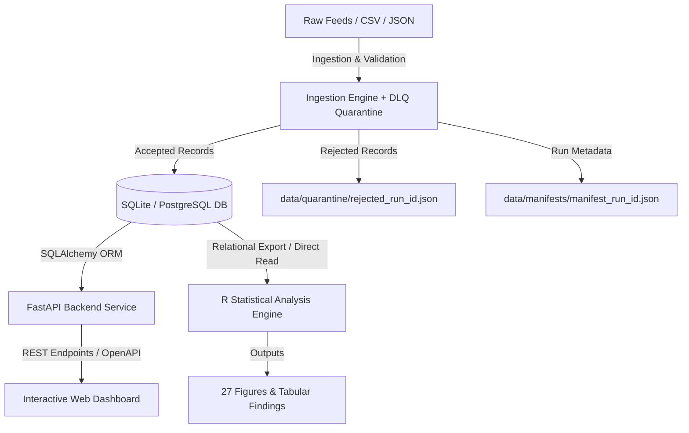

# TechScape: Production-Grade Software Engineering Transformation Plan

## Executive Summary
This implementation plan outlines the end-to-end transformation of **TechScape** from an academic script-driven research project into a **production-quality, fully testable, containerized data platform**. 

The goal is to preserve the project's unique empirical strengths (Sri Lankan IT labor market analysis, zero-fabrication provenance standard, and econometric rigor) while introducing modern software engineering practices: deterministic packaging, a relational database, a FastAPI REST service, resilient ETL ingestion with quarantine/dead-letter-queues (DLQ), standard testing frameworks (`pytest` and `testthat`), XSS-safe frontend-to-API communication, and containerized deployment.

---

## User Review Required

> [!IMPORTANT]
> **Key Architecture Decisions for Approval:**
> 1. **Persistence Target**: We propose starting with an indexed **SQLite** database (`data/techscape.db`) managed via SQLAlchemy 2.0 and Python migrations. This provides zero external infrastructure overhead for CI and local evaluation, with a Docker Compose option for PostgreSQL.
> 2. **R Pipeline Execution Isolation**: To avoid creating an unmaintainable 4GB+ Docker container with compile-time bottlenecks, the production REST API and dashboard will run on a lightweight Python runtime (`python:3.11-slim`), while the heavy R analytical engine will run via a dedicated Docker container / CLI batch runner.
> 3. **Breaking Change in Ingestion Adapters**: Current adapters quietly replace missing fields with placeholder defaults (`"Unknown Role"`, `"2026-08-01"`). We will replace this with **strict validation and a quarantine DLQ file**, rejecting malformed records rather than mutating them.

---

## Proposed Phases & Architecture Overview



---

## Phase 1: Tooling, Packaging, and Reproducibility

### Objectives
Enable any developer to clone the repository and run setup, pipeline, tests, and API with predictable outcomes on Windows, Linux, and macOS without hardcoded paths.

#### [NEW] [pyproject.toml](pyproject.toml)
- Modern standard Python project packaging (PEP 621 / Hatchling or Flit).
- Pin dependencies: `fastapi`, `uvicorn[standard]`, `pydantic>=2.0`, `sqlalchemy>=2.0`, `pytest`, `pytest-cov`, `httpx`, `structlog`.
- Define CLI entrypoints (`techscape = python.runner:main`).

#### [NEW] [requirements.txt](requirements.txt) & [requirements-dev.txt](requirements-dev.txt)
- Frozen dependency lockfile for reproducible standard `pip install -r requirements.txt`.

#### [NEW] [Makefile](Makefile)
- Standard task runner commands:
  ```makefile
  setup:    ## Install python dependencies
  test:     ## Run pytest and testthat suites
  lint:     ## Run code style and hygiene audits
  db-init:  ## Build SQLite database from cleaned records
  serve:    ## Launch FastAPI backend server
  pipeline: ## Run complete Python + R workflow
  audit:    ## Verify file claims, figures, tables, and README counts
  ```

#### [NEW] [.github/workflows/ci.yml](.github/workflows/ci.yml)
- GitHub Actions workflow testing on `ubuntu-latest` and `windows-latest`.
- Steps:
  1. Checkout code
  2. Setup Python 3.11 + caching
  3. Install dependencies
  4. Run `pytest --cov=python tests/`
  5. Setup R + cache R packages
  6. Run `testthat` data quality checks
  7. Run repo audit check (`python -m python.audit`)

#### [MODIFY] [README.md](README.md)
- Replace hardcoded Windows Rscript path (`& "C:\Program Files\R\R-4.6.1\bin\Rscript.exe"`) with platform-agnostic commands.
- Update badges to reflect actual CI status, real pytest test count, and API documentation link.

---

## Phase 2: Resilient Ingestion, Provenance & Quarantine Engine

### Objectives
Eliminate silent data fabrication, enforce strict entity schemas, and implement an audit-ready ingestion manifest and dead-letter quarantine mechanism.

#### [MODIFY] [python/ingestion/source_adapters.py](python/ingestion/source_adapters.py)
- Refactor `JSONSourceAdapter`, `TSVSourceAdapter`, and `CSVSourceAdapter` to use strict Pydantic v2 schemas (`RawJobIngestionModel`).
- **Remove silent fallbacks**:
  - If `job_title` is missing or empty, mark record as invalid (no `"Unknown Role"`).
  - If `company` is missing, mark as invalid or explicitly `None` (no `"Confidential"`).
  - If `date_posted` is missing, mark as invalid (no `"2026-08-01"` default).
  - If `source_url` is missing or invalid URL, mark as invalid (no `"https://example.com/json-source"`).

#### [NEW] [python/ingestion/quarantine.py](python/ingestion/quarantine.py)
- Route any record failing schema validation or provenance constraints into `data/quarantine/quarantine_<run_id>.json`.
- Each quarantined record contains: `raw_record`, `validation_errors`, `source_name`, `timestamp`.

#### [NEW] [python/ingestion/manifest.py](python/ingestion/manifest.py)
- Tracks pipeline execution metadata:
  ```json
  {
    "run_id": "2026-09-22T02:00:00Z",
    "source": "topjobs",
    "records_read": 120,
    "records_accepted": 108,
    "records_quarantined": 12,
    "source_hash_sha256": "...",
    "duration_seconds": 1.42
  }
  ```
- Persist to `data/manifests/manifest_<run_id>.json`.

---

## Phase 3: Relational Persistence Layer (SQLite / PostgreSQL)

### Objectives
Replace flat CSV reliance for application serving with an ACID-compliant relational schema, indexed for analytical search.

#### [NEW] [python/db/models.py](python/db/models.py)
- Define SQLAlchemy 2.0 declarative models:
  - **`Job`**: `id`, `job_id` (unique, indexed), `title`, `company`, `location`, `career_category` (indexed), `work_mode` (indexed), `seniority_level` (indexed), `employment_type`, `experience_min`, `experience_max`, `salary_min`, `salary_max`, `currency`, `source`, `source_url`, `date_posted`, `collection_date`, `is_synthetic`.
  - **`Skill`**: `id`, `name` (unique, indexed), `category` (indexed).
  - **`JobSkill`**: `id`, `job_id` (FK to jobs.job_id, indexed), `skill_id` (FK to skills.id, indexed), `is_mandatory`.
  - **`MacroIndicator`**: `id`, `indicator_name`, `period`, `value`, `unit`, `source`.
  - **`PipelineRun`**: `id`, `run_id` (unique), `timestamp`, `accepted_count`, `quarantined_count`, `status`.

#### [NEW] [python/db/session.py](python/db/session.py)
- Engine setup supporting SQLite (`sqlite:///data/techscape.db`) with PRAGMA foreign keys enabled, or PostgreSQL via environment variable `DATABASE_URL`.

#### [NEW] [python/db/seed.py](python/db/seed.py)
- Idempotent database loader populating the tables from the verified empirical dataset (`jobs_real_sample.csv` and `job_skills_real_sample.csv`) and macro indicators.

---

## Phase 4: Production REST API (FastAPI)

### Objectives
Provide a well-documented, type-safe HTTP API serving jobs, skills, analytical aggregations, and operational health metrics.

#### Structure
```text
api/
├── main.py                     # FastAPI app factory, CORS, error handlers, static mounting
├── config.py                   # Environment settings via Pydantic BaseSettings
├── dependencies.py             # DB session dependencies
├── schemas/
│   ├── jobs.py                 # JobResponse, JobListResponse, JobFilterParams
│   ├── skills.py               # SkillResponse, TopSkillResponse
│   ├── analytics.py            # CareerDistribution, SalaryAnalytics, MacroSummary
│   └── operational.py          # HealthResponse, MetadataResponse
├── routes/
│   ├── jobs.py                 # GET /api/v1/jobs, GET /api/v1/jobs/{job_id}
│   ├── skills.py               # GET /api/v1/skills/top, GET /api/v1/skills
│   ├── analytics.py            # GET /api/v1/analytics/careers, /salaries, /summary
│   └── operational.py          # GET /api/v1/health, GET /api/v1/metadata
└── services/
    ├── job_service.py          # Filtering, pagination, sorting
    └── analytics_service.py    # SQL aggregation logic for real-time KPIs
```

#### Core Endpoints
1. `GET /api/v1/health`: Returns database connectivity status and pipeline freshness.
2. `GET /api/v1/metadata`: Returns dataset version, empirical posting count, last pipeline run timestamp.
3. `GET /api/v1/jobs`: Filterable by `career_category`, `work_mode`, `seniority_level`, with pagination (`limit`, `offset`).
4. `GET /api/v1/jobs/{job_id}`: Full job specification including normalized skills.
5. `GET /api/v1/skills/top`: Returns skill frequency rankings grouped by career track.
6. `GET /api/v1/analytics/summary`: Aggregate metrics matching RQ1–RQ8 findings.

---

## Phase 5: Modern Testing Framework Overhaul

### Objectives
Standardize all tests on idiomatic industry-standard frameworks (`pytest` and `testthat`) with automated coverage reporting.

#### Python Testing (`pytest`)
- Reorganize tests into:
  ```text
  tests/
  ├── conftest.py                   # Pytest fixtures: db session, mock data, test client
  ├── unit/
  │   ├── test_source_adapters.py   # Malformed input, strict validation, edge cases
  │   ├── test_quarantine.py        # DLQ routing and error schemas
  │   ├── test_text_hygiene.py      # Unicode, UTF-8 BOM, control chars
  │   └── test_raw_validator.py     # Schema provenance rules
  ├── integration/
  │   ├── test_api_jobs.py          # Filtering, pagination, 404s, invalid params
  │   ├── test_api_analytics.py     # Math consistency against database state
  │   └── test_db_relational.py     # Cascade delete, foreign key constraints, indexes
  ```

#### R Testing (`testthat`)
- Convert [`tests/data_quality/test_real_and_inferential.R`](tests/data_quality/test_real_and_inferential.R) into standard `testthat` format:
  ```text
  tests/testthat/
  ├── test_provenance.R            # Provenance and zero-fabrication assertions
  ├── test_referential_integrity.R # Foreign keys between jobs and skills
  ├── test_inferential_stats.R     # p-values, test statistics consistency
  └── test_macro_bounds.R          # Macroeconomic bounds checking
  ```
- Runner command: `Rscript -e "testthat::test_dir('tests/testthat')"` with standard non-zero exit codes on failure.

---

## Phase 6: Frontend Hardening & Live API Integration

### Objectives
Eliminate DOM-based XSS vulnerabilities and connect the frontend to the live REST API with graceful state handling.

#### [MODIFY] [dashboard/app.js](dashboard/app.js)
- **Fix XSS Vulnerabilities**:
  - Eliminate all `innerHTML` assignments using unescaped job titles, employer names, or descriptions.
  - Implement a safe DOM helper (`safeElement(tag, textContent, attributes)`) or sanitize untrusted strings before rendering.
  - Safely validate `source_url` against HTTP/HTTPS regex before setting `href`.
- **Connect to FastAPI**:
  - Replace static `window.TECHSCAPE_DATA` dependency with asynchronous `fetch('/api/v1/jobs?...')` and `fetch('/api/v1/analytics/summary')`.
  - Provide fallback to bundled data if API is unreachable (offline academic mode).
  - Add visual **Loading**, **Empty Results**, and **Error** states.
  - Synchronize filter selections with URL query parameters (`?category=Cloud&mode=Remote`) for shareable deep links.

---

## Phase 7: R Pipeline Refactoring into Pure Functions

### Objectives
Eliminate side-effects on script `source()`, wrap business logic in pure, testable functions, and provide a clean CLI.

#### Refactoring Plan
- Split R analysis into reusable modules in `R/modules/`:
  - `R/modules/cleaning_functions.R`
  - `R/modules/statistical_functions.R`
  - `R/modules/visualization_functions.R`
- Modify `R/05_` through `R/10_` scripts so that their logic is encapsulated in functions:
  ```r
  compute_career_distribution <- function(jobs_df) { ... }
  plot_career_distribution <- function(summary_df, output_path) { ... }
  ```
- Provide `R/run_pipeline.R` as the single executable coordinator.

---

## Phase 8: Containerization, Auditing & Observability

### Objectives
Provide Docker deployment, continuous observability, and automated repository claim auditing.

#### [NEW] [Dockerfile](Dockerfile)
- Lightweight production container based on `python:3.11-slim`.
- Installs dependencies, sets up SQLite database, and runs FastAPI via Uvicorn.
- Exposes port 8000.

#### [NEW] [docker-compose.yml](docker-compose.yml)
- Sets up two services:
  1. `api`: FastAPI backend + static dashboard web server.
  2. *(Optional)* `db`: PostgreSQL 16 container with persistent volume.

#### [NEW] [python/audit.py](python/audit.py)
- Automated repo consistency check (`make audit` or `python -m python.audit`):
  - Validates that all files cited in `README.md` actually exist.
  - Verifies figure count in `outputs/figures/` matches claimed count.
  - Verifies table count in `outputs/tables/` matches claimed count.
  - Validates that macroeconomic values in docs match source data.
  - Ensures no local filesystem links (`file:///d:/...`) exist in committed markdown.

---

## Verification Plan

### Automated Tests
1. **Python Unit & Integration Tests**:
   ```bash
   pytest tests/ -v --cov=python --cov-report=term-missing
   ```
   *Pass Criteria*: 100% of unit and integration tests pass; coverage > 85%.
2. **API Endpoint Testing**:
   ```bash
   pytest tests/integration/test_api_*.py -v
   ```
   *Pass Criteria*: All endpoints return valid JSON matching Pydantic response models; filtering and pagination work properly; 404/422 status codes returned on invalid input.
3. **R Data Quality Suite**:
   ```bash
   Rscript -e "testthat::test_dir('tests/testthat')"
   ```
   *Pass Criteria*: All 16+ data quality assertions pass with 0 failures.
4. **Repository Audit**:
   ```bash
   python -m python.audit
   ```
   *Pass Criteria*: 0 path errors, 0 claim contradictions, 0 broken local links.

### Manual Verification
1. **Interactive API Docs**: Start server (`uvicorn api.main:app --reload`) and navigate to `http://localhost:8000/docs` in the browser to verify OpenAPI Swagger schema.
2. **Dashboard Interactive Flow**: Open dashboard, filter by multiple dimensions (e.g. "Cloud & DevOps" + "Hybrid"), verify dynamic UI update without page reload, check browser console for 0 CSP/XSS warnings.
3. **Docker Build & Run**:
   ```bash
   docker build -t techscape-api .
   docker run -p 8000:8000 techscape-api
   ```
   Verify `http://localhost:8000/api/v1/health` returns `{"status": "healthy"}`.
