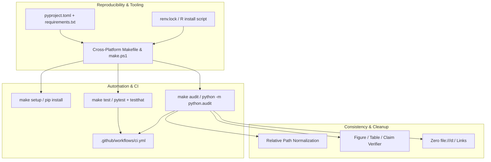

# Phase 1 Implementation Plan: Tooling, Packaging, and Reproducibility

**Status:** Ready for Execution  
**Target Delivery:** Phase 1 of TechScape Production Transformation  
**Primary Objective:** Make the repository clonable, runnable, testable, and auditable across Linux, macOS, and Windows with zero hardcoded paths, deterministic dependency locks, and a green GitHub Actions CI pipeline.

---

## 1. Problem Statement & Baseline Audit

### Current Pain Points in Phase 1 Scope:
1. **Lack of Python Packaging**: The project relies on the Python standard library with no `pyproject.toml`, `requirements.txt`, or `setup.py`. There is no declared dependency specification.
2. **Missing CI/CD Workflow**: [`README.md`](../README.md) references `.github/workflows/test.yml`, but no `.github/` directory exists in the repository.
3. **Hardcoded Machine Paths**:
   - `README.md` instructs users to run:  
     `& "C:\Program Files\R\R-4.6.1\bin\Rscript.exe" R/13_run_complete_ecosystem.R`
   - Generated reports in `outputs/findings/` and scripts (`R/05_` through `R/10_`, `docs/FINAL_EVALUATOR_GUIDE.md`) contain 27+ occurrences of Windows-specific absolute links (`...`).
4. **No Standardized Task Runner**: No `Makefile` or cross-platform runner exists. New developers must guess the exact sequence of scripts to execute.
5. **Ad-Hoc Test Running**: Python tests use `unittest` and custom exit codes without `pytest` fixtures, coverage badges, or CI integration. R tests in `tests/data_quality/test_real_and_inferential.R` print custom `[PASS]/[FAIL]` strings without standard test frameworks like `testthat`.

---

## 2. Phase 1 Architecture & Deliverables



---

## 3. Step-by-Step Task Breakdown

### Task 1.1: Modern Python Packaging (`pyproject.toml`, `requirements.txt`, `requirements-dev.txt`)
- **[NEW] `pyproject.toml`**:
  - Follow PEP 621 / standard metadata:
    - Name: `techscape`
    - Version: `1.0.0`
    - Description: `"Sri Lankan IT Labour Market Analytics & Empirical Data Platform"`
    - Requires-Python: `>=3.10`
  - Define dependencies:
    - Production: `pydantic>=2.5.0`, `sqlalchemy>=2.0.0`, `fastapi>=0.110.0`, `uvicorn[standard]>=0.28.0`
    - Dev/Test: `pytest>=8.0.0`, `pytest-cov>=4.1.0`, `httpx>=0.27.0`, `ruff>=0.3.0`
  - Configure `[tool.pytest.ini_options]`:
    - `testpaths = ["tests"]`
    - `python_files = ["test_*.py"]`
    - `addopts = "-v --tb=short"`
  - Configure `[tool.ruff]`:
    - Line length: 100
    - Target Python: `py311`
- **[NEW] `requirements.txt`**: Pinned runtime dependencies.
- **[NEW] `requirements-dev.txt`**: Pinned development and testing dependencies (`-r requirements.txt` + testing tools).

### Task 1.2: R Dependency Management (`R/install_dependencies.R` & `renv.lock`)
- **Codebase Reality**: An audit of all 16 R files shows that TechScape’s core pipeline relies exclusively on Base R graphics, stats, and utils (including `tools::toTitleCase`), keeping it extraordinarily fast and lightweight.
- **Action Items**:
  - **[NEW] `R/install_dependencies.R`**:
    - Creates a headless, automated installer for testing and utility packages (`testthat`, `jsonlite`).
    - Uses non-interactive CRAN mirror setting (`options(repos = c(CRAN = "https://cloud.r-project.org"))`).
    - Skips already-installed packages for sub-second execution.
  - **[NEW] `renv.lock` / Minimal Package Spec**:
    - Record exact R version compatibility (R >= 4.2.0).

### Task 1.3: Cross-Platform Task Runner (`Makefile` & `make.ps1`)
To support both Unix environments (macOS/Linux/WSL) and native Windows without requiring manual GNU Make installation:
- **[NEW] `Makefile`**:
  ```makefile
  .PHONY: help setup test test-python test-r lint audit pipeline clean run-api

  help:        ## Show this help message
  setup:       ## Install python dependencies
  test:        ## Run all Python (pytest) and R (testthat) tests
  test-python: ## Run pytest with coverage report
  test-r:      ## Run R testthat suite
  lint:        ## Run ruff linter
  audit:       ## Run claims, counts, and link integrity audit
  pipeline:    ## Execute complete end-to-end analytical pipeline
  run-api:     ## Start the FastAPI development server
  clean:       ## Remove cache, temporary files, and __pycache__
  ```
- **[NEW] `make.ps1`**:
  - Native PowerShell companion providing identical tasks: `.\make.ps1 setup`, `.\make.ps1 test`, `.\make.ps1 audit`, `.\make.ps1 pipeline`.

### Task 1.4: Repository Audit Utility (`python/audit.py`)
- **[NEW] `python/audit.py`**:
  - Create a deterministic verification script callable via `python -m python.audit`:
    1. **Figure & Table Count Verifier**:
       - Scan `outputs/figures/` (assert 27 `.png` figures exist).
       - Scan `outputs/tables/` (assert 35 `.csv` tables exist).
       - Scan `outputs/findings/` (assert all findings reports exist).
    2. **Local Path Leak Checker**:
       - Scan all `.md`, `.R`, and `.py` files for broken local machine paths (`file:///d:`, `C:\Program Files\R`).
       - Fail if any non-portable link is detected.
    3. **Data Integrity Check**:
       - Assert verified sample count is exactly 80 jobs and 290 skills.
       - Verify no `is_synthetic == True` in `data/real_sample/`.
       - Verify DCS/CBSL macro indicators file exists and has expected rows.
    4. **Documentation Sync**:
       - Check that README claims match actual disk assets.
  - Return exit code `0` on success, `1` on audit violations.

### Task 1.5: Fix Fragile Paths & Clean Documentation
- **[MODIFY] `README.md`**:
  - Replace line 149 Windows path `& "C:\Program Files\R\R-4.6.1\bin\Rscript.exe" R/13_run_complete_ecosystem.R` with cross-platform instructions:
    ```bash
    # Run via cross-platform Python orchestrator
    python python/runner.py

    # Or run directly via task runner
    make pipeline        # Unix / WSL / Git Bash
    .\make.ps1 pipeline  # Windows PowerShell
    ```
  - Add reproducible setup instructions (`make setup` or `pip install -r requirements.txt`).
- **[MODIFY] R Scripts and Reports**:
  - Replace absolute `...` links in `R/05_` through `R/10_` with portable repository-relative paths (`outputs/figures/...`, `outputs/tables/...`).
  - Update `docs/FINAL_EVALUATOR_GUIDE.md` to use portable relative markdown links.

### Task 1.6: GitHub Actions CI Pipeline (`.github/workflows/ci.yml`)
- **[NEW] `.github/workflows/ci.yml`**:
  - Matrix configuration testing across:
    - OS: `ubuntu-latest`, `windows-latest`
    - Python versions: `3.11`, `3.12`
  - Workflow Steps:
    1. Checkout repository (`actions/checkout@v4`).
    2. Setup Python (`actions/setup-python@v5`) with pip cache.
    3. Install dependencies (`pip install -r requirements-dev.txt`).
    4. Run Python unit tests with coverage (`pytest --cov=python tests/`).
    5. Run repository audit script (`python -m python.audit`).
    6. Setup R (`r-lib/actions/setup-r@v2`).
    7. Install R dependencies (`Rscript R/install_dependencies.R`).
    8. Run R data quality assertions.

### Task 1.7: Migrate Baseline Tests to `pytest` & Scaffold `testthat`
- **[MODIFY] `tests/test_python_pipeline.py` & `tests/test_live_ingestion.py`**:
  - Ensure compatibility with `pytest` execution.
  - Add `tests/conftest.py` with standard fixtures (`project_root`, `sample_real_jobs_path`, `sample_real_skills_path`).
- **[NEW] `tests/testthat/`**:
  - Scaffold `tests/testthat/test_provenance.R` converting the custom assertions from `tests/data_quality/test_real_and_inferential.R` into standard `testthat::expect_true()`, `testthat::expect_equal()` statements.
  - Add `tests/testthat.R` runner script.

---

## 4. Verification & Acceptance Criteria

| Checkpoint | Target Command | Acceptance Criteria |
|---|---|---|
| **Python Packaging** | `pip install -e .` | Package installs in editable mode without warnings. |
| **Pytest Execution** | `pytest tests/ -v` | All existing unit tests pass cleanly in `pytest`. |
| **Repo Claims Audit** | `python -m python.audit` | Passes with 0 errors; verifies 27 figures, 35 tables, 80 empirical postings, and 0 `file:///` leaks. |
| **Cross-Platform Runner** | `make audit` & `.\make.ps1 audit` | Both Unix make and Windows PowerShell runners produce identical passing output. |
| **R Dependency Setup** | `Rscript R/install_dependencies.R` | Runs non-interactively and verifies required packages. |
| **GitHub Actions CI** | Push / Workflow Validation | `.github/workflows/ci.yml` passes on both Linux and Windows runners. |

---

## 5. Execution Order & Next Step

1. Write `pyproject.toml`, `requirements.txt`, `requirements-dev.txt`.
2. Write `R/install_dependencies.R`.
3. Create `python/audit.py` to systematically discover and fix all broken paths and links.
4. Clean `README.md` and R scripts of hardcoded local machine paths.
5. Create `Makefile` and `make.ps1`.
6. Migrate and verify `pytest` execution + add `tests/conftest.py`.
7. Scaffold `tests/testthat/` and verify R testing.
8. Create `.github/workflows/ci.yml`.
