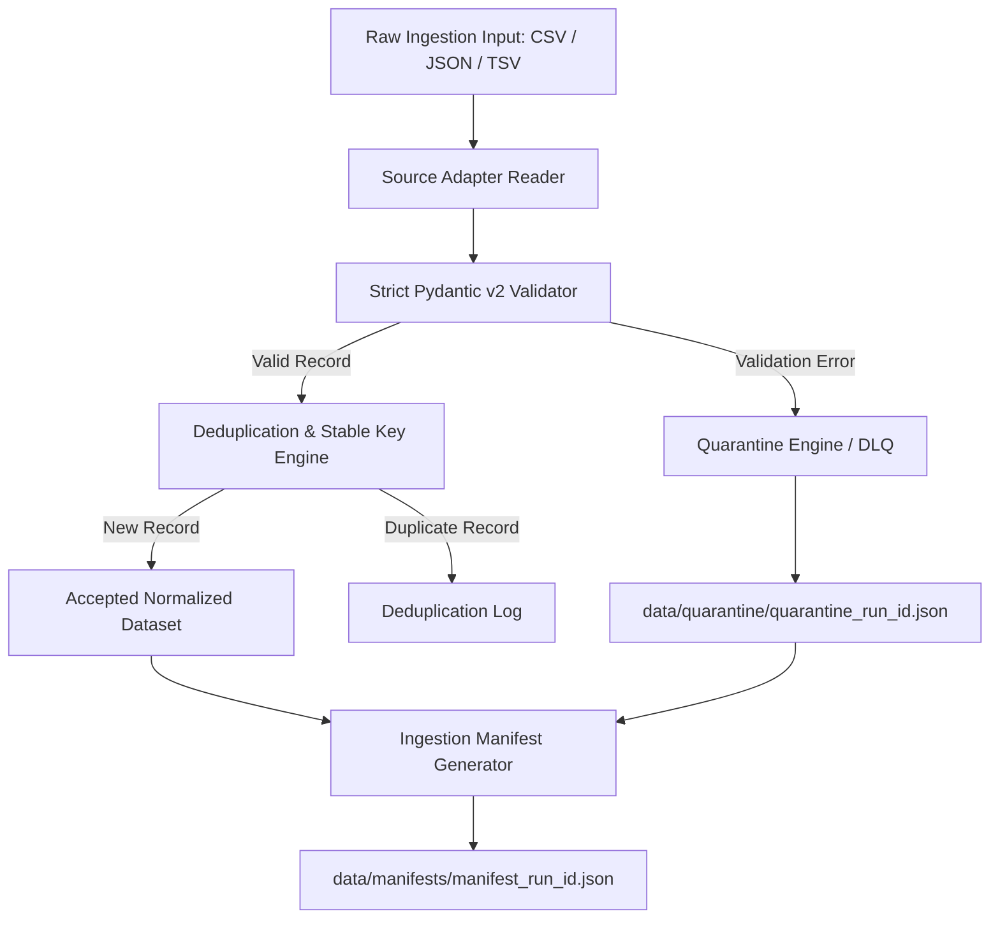

# Phase 2 Implementation Plan: Resilient Ingestion, Strict Validation & Dead-Letter Quarantine Engine

**Document Status:** Ready for Execution  
**Target Milestone:** Phase 2 of TechScape Production Transformation  
**Primary Goal:** Transform TechScape's data ingestion layer from a permissive script into an **audit-ready, production-grade ETL pipeline** with strict Pydantic v2 schemas, zero silent fallback defaults, a Dead-Letter Queue (DLQ) quarantine mechanism, and cryptographically hashed ingestion manifests.

---

## 1. Problem Statement & Current Architectural Deficiencies

In the baseline implementation of [`python/ingestion/source_adapters.py`](../python/ingestion/source_adapters.py):
1. **Silent Fallback Anti-Pattern:** When incoming records lack critical fields, the adapters silently fabricate placeholder values:
   - Missing `job_title` defaults to `"Unknown Role"`
   - Missing `company` defaults to `"Confidential"`
   - Missing `date_posted` defaults to `"2026-08-01"`
   - Missing `source_url` defaults to `"https://example.com/json-source"`
   *Risk:* In production ETL, quietly coercing bad data into valid rows compromises the core "Zero Fabrication" governance standard.
2. **No Dead-Letter Queue (DLQ):** When records are malformed or fail referential integrity, there is no quarantine location recording why they failed or retaining the raw data for debugging.
3. **No Ingestion Run Tracking:** No execution manifest records the run ID, SHA-256 source hash, acceptance/rejection throughput, or error breakdown.
4. **Permissive Typing:** The adapters use raw `.get()` dictionaries without schema validation, field-level constraints, or URL structure checks.

---

## 2. Phase 2 Architecture Overview



---

## 3. Detailed Component Specifications

### 3.1 Strict Pydantic Validation Models
**File:** `python/ingestion/schemas.py` [NEW]
- Define immutable, strictly validated models:
  - **`RawJobIngestionSchema`**:
    - `job_id`: Non-empty string.
    - `job_title`: Required string, min length 2, stripped of HTML entities. (No `"Unknown Role"`).
    - `company`: Required string, min length 2. (No `"Confidential"` fallback).
    - `date_posted`: Strict ISO date format (`YYYY-MM-DD`). Rejects unparseable dates.
    - `source`: Validated source name (`topjobs`, `itpro`, `linkedin`, etc.).
    - `source_url`: Strict HTTP/HTTPS URL pattern validation. (Rejects `"example.com"` defaults).
    - `career_category`: Must match one of 8 canonical taxonomies or route to review.
    - `work_mode`: Constrained to `{"Hybrid", "On-site", "Remote"}`.
    - `salary_min`, `salary_max`: Optional positive floats; validator checks `salary_max >= salary_min`.
    - `experience_min`, `experience_max`: Optional non-negative floats; validator checks `experience_max >= experience_min`.
  - **`RawSkillIngestionSchema`**:
    - `job_id`: Foreign key reference to parent job.
    - `skill_name`: Non-empty string, normalized casing.
    - `is_mandatory`: Boolean.

### 3.2 Dead-Letter Queue (DLQ) Quarantine System
**File:** `python/ingestion/quarantine.py` [NEW]
- Directory: `data/quarantine/`
- Every rejected row is recorded with full provenance:
  ```json
  {
    "quarantine_id": "QL-20260929-0012",
    "run_id": "2026-09-29T14:30:00Z",
    "source_file": "sample_feed.json",
    "line_or_index": 14,
    "raw_payload": { ... },
    "validation_errors": [
      {
        "field": "date_posted",
        "error_type": "invalid_date_format",
        "message": "Value 'invalid-date' does not match YYYY-MM-DD"
      },
      {
        "field": "source_url",
        "error_type": "missing_required_field",
        "message": "Field 'source_url' is mandatory and cannot be empty"
      }
    ],
    "timestamp": "2026-09-29T14:30:01.234Z"
  }
  ```

### 3.3 Ingestion Run Manifest Engine
**File:** `python/ingestion/manifest.py` [NEW]
- Directory: `data/manifests/`
- Records cryptographic provenance and execution metrics for every batch run:
  ```json
  {
    "manifest_version": "1.0",
    "run_id": "RUN-20260929-143000",
    "timestamp_utc": "2026-09-29T14:30:00Z",
    "source_name": "topjobs",
    "input_file": "data/incoming/jobs.json",
    "input_sha256": "e3b0c44298fc1c149afbf4c8996fb92427ae41e4649b934ca495991b7852b855",
    "records_read": 120,
    "records_accepted": 108,
    "records_quarantined": 12,
    "records_deduplicated": 5,
    "quarantine_file": "data/quarantine/quarantine_RUN-20260929-143000.json",
    "output_file": "data/processed/jobs_normalized.csv",
    "duration_seconds": 0.428,
    "status": "COMPLETED_WITH_QUARANTINE"
  }
  ```

### 3.4 Refactoring Source Adapters
**File:** `python/ingestion/source_adapters.py` [MODIFY]
- Refactor `JSONSourceAdapter`, `CSVSourceAdapter`, and `TSVSourceAdapter`:
  - Replace dictionary `.get("field", "default")` with Pydantic model parsing.
  - Catch `ValidationError` per record without crashing the entire batch.
  - Route valid records to the accepted collector and failed records to the Quarantine Engine.
  - Return typed results: `IngestionBatchResult(accepted_jobs, accepted_skills, quarantined_records, manifest)`.

### 3.5 Deduplication with Stable Composite Keys
**File:** `python/ingestion/deduplication.py` [NEW]
- Create deterministic hash key generator:
  - `stable_key = SHA256(canonical_title + company + date_posted + location)`
- Discard exact duplicates within the same batch while preserving the earliest record.

---

## 4. Testing & Verification Strategy

### 4.1 Pytest Unit Tests
**File:** `tests/unit/test_resilient_ingestion.py` [NEW]
1. **Malformed Input Tests:**
   - JSON feed with missing `job_title` $\rightarrow$ Asserts record is rejected and sent to DLQ (no `"Unknown Role"` created).
   - Record with unparseable date (`"yesterday"`) $\rightarrow$ Asserts DLQ routing with `invalid_date_format`.
   - Record with placeholder URL (`"example.com"`) $\rightarrow$ Asserts URL rejection.
2. **Boundary Tests:**
   - Negative salary (`salary_min = -5000`) $\rightarrow$ Asserts validation error.
   - Reversed salary bounds (`salary_min = 500000, salary_max = 300000`) $\rightarrow$ Asserts boundary error.
   - Negative experience (`experience_min = -1`) $\rightarrow$ Asserts validation error.
3. **Quarantine Verification:**
   - Verify quarantine file is generated in `data/quarantine/` with matching `run_id`.
   - Verify line numbers, raw payloads, and specific error reasons match expectations.
4. **Manifest Verification:**
   - Verify SHA-256 hash matches input file.
   - Verify mathematical consistency: `records_read == records_accepted + records_quarantined + records_deduplicated`.

### 4.2 Integration Tests
**File:** `tests/integration/test_ingestion_pipeline.py` [NEW]
- Run an end-to-end ingestion pipeline on a dirty test fixture containing 5 valid, 3 malformed, and 2 duplicate records.
- Verify accepted records are exported, 3 records are quarantined, 2 duplicates are logged, and a valid manifest is generated.

---

## 5. Execution Order

| Step | Action | Files Affected |
|---|---|---|
| **Step 1** | Define Pydantic ingestion schemas | `python/ingestion/schemas.py` |
| **Step 2** | Implement Quarantine & DLQ engine | `python/ingestion/quarantine.py` |
| **Step 3** | Implement Ingestion Manifest writer | `python/ingestion/manifest.py` |
| **Step 4** | Implement composite deduplication | `python/ingestion/deduplication.py` |
| **Step 5** | Refactor source adapters to remove silent defaults | `python/ingestion/source_adapters.py` |
| **Step 6** | Write comprehensive unit and integration tests | `tests/unit/test_resilient_ingestion.py`, `tests/integration/test_ingestion_pipeline.py` |
| **Step 7** | Integrate with `make ingest` and `.\make.ps1 ingest` | `Makefile`, `make.ps1` |
| **Step 8** | Run full verification suite and verify 100% test pass | `pytest`, `audit.py` |
